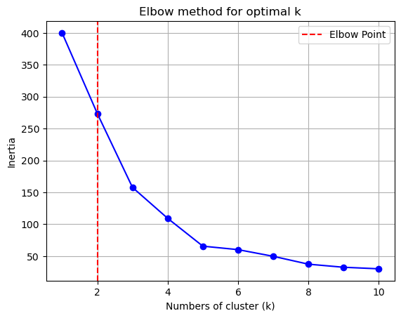
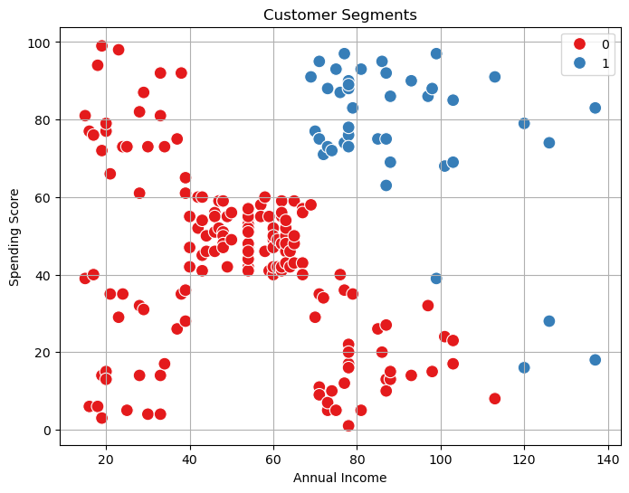

# 🛍️ Customer Segmentation using KMeans Clustering

This project applies **KMeans Clustering** to segment customers based on their **Annual Income** and **Spending Score**. It helps businesses identify different customer types and design targeted marketing strategies.

---

## 📌 Objective

To group customers into distinct segments using **unsupervised learning**, and derive business insights based on their spending behavior and income level.

---

## 📁 Dataset

- **Source**: [Kaggle - Mall Customer Segmentation Data](https://www.kaggle.com/datasets/vjchoudhary7/customer-segmentation-tutorial)
- **Columns Used**:
  - `Annual Income (k$)`
  - `Spending Score (1-100)`

---

## 🔧 Tools & Libraries Used

- Python 🐍
- pandas, numpy
- matplotlib, seaborn
- scikit-learn (KMeans, StandardScaler)

---

## 📊 Steps Performed

1. **Data Loading & Preprocessing**
   - Selected relevant features
   - Scaled data using `StandardScaler`

2. **KMeans Clustering**
   - Applied the **Elbow Method** to find optimal number of clusters (`k`)
   - Chose `k = 2` based on maximum inertia drop

3. **Visualization**
   - Plotted customer segments using scatter plot
   - Color-coded based on cluster labels

4. **Business Interpretation**
   - Segment 0: Mid-income, moderate spenders
   - Segment 1: High-income, high spenders → premium target group

---

## 📈 Visualizations

### Elbow Method  
*(Used to determine optimal k)*  

### Final Clusters  
*(Each color represents a customer segment)*  

---

## 💼 Business Insights

- Segment 1 customers (~$90k income, ~77 score) are **ideal for premium services or loyalty programs**.
- Segment 0 customers (~$52k income, ~43 score) are **stable but moderate** in spending; engage through occasional offers.

---

## 📂 Dataset Source

This project uses the **Mall Customer Segmentation Data** available on [Kaggle](https://www.kaggle.com/datasets/vjchoudhary7/customer-segmentation-tutorial), uploaded by **Vikram Choudhary**.

---

## 🚀 Output

Segmented customer data is saved to `Customer_Segments.csv` with assigned cluster labels.

---

## 👨‍💻 Author

**Yousuf Raja**  
Aspiring Data Analyst | ML & AI Enthusiast  
[LinkedIn](https://www.linkedin.com/in/yousufraja0930) | [GitHub](https://www.github.com/Yousuf0930))

---

## 📌 Tags

`#KMeans` `#CustomerSegmentation` `#MachineLearning` `#DataScience` `#EDA` `#UnsupervisedLearning` `#Python`

